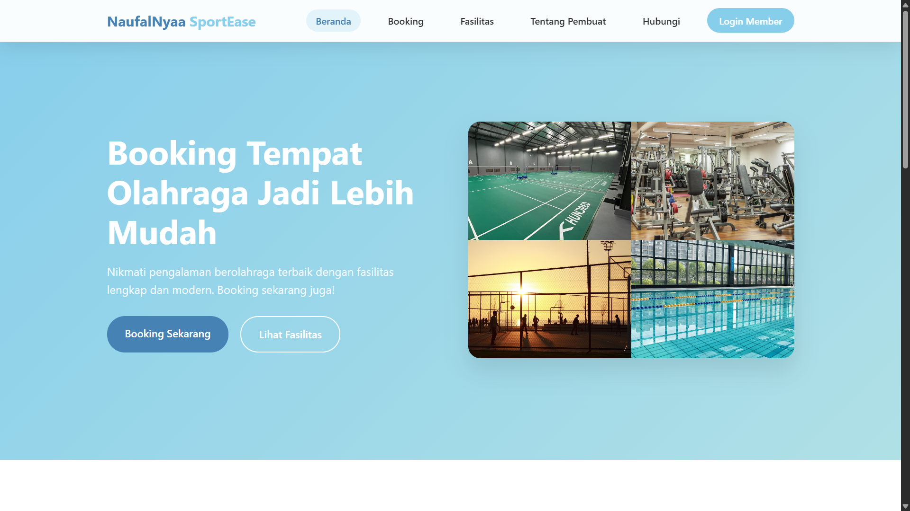

# 🥃 NaufalNyaa SportEase | Ujian Akhir Semester - Pengenalan Pemrograman

## 🌐 Deskripsi Singkat

**Awiee Bar** adalah website landing page bergaya modern yang dirancang untuk menampilkan tampilan profesional dari sebuah Penyewaan tempat olahraga eksklusif. Tempat ini memiliki 6 arena olahraga yaitu Lapangan Futsal, Basket, minisoccer, kolam renang, Gym & Fitnes. menghadirkan suasana elegan dan berkelas bagi para pengunjungnya.

---

## 📁 Struktur Proyek

---

## 🔗 Live Preview

> Klik tautan berikut untuk melihat langsung website-nya:
🌍 [Lihat Website NaufalNyaa SportEase](https://mbullhexscript.github.io/Sports/)

---

## 💻 Teknologi yang Digunakan

- **HTML5**
- **CSS3 (Modern Styling & Animations)**
- **Responsive Web Design (Media Queries)**

---

## 🧑‍🎓 Informasi Pembuat

| Keterangan | Detail |
|-----------|--------|
| Nama      | Naufal Afaf Ekayana |
| Hobi       | Jogging santai |
| Github | @NaufalNyaa |

---

## 📜 Lisensi

Proyek ini dibuat untuk kepentingan edukasi sebagai bagian dari Konten Youtube dan tidak untuk tujuan komersial.

---

**Terima kasih atas bimbingan dan ilmunya selama satu semester penuh 🙏**
_— Mbull Gacor_
